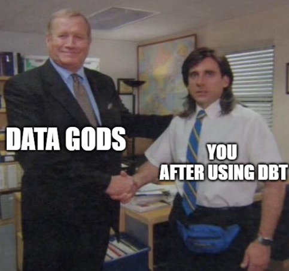

# dbt-nhl-breakouts
Transforming the `raw` nhl data into `analytics-models` with dbt



## Table of contents
* [Introduction](#introduction)
* [Setup](#setup)
* [Resources](#resources)
* [Developer contact](#developer-contact)

## Introduction
---

Welcome to the `dbt-nhl-breakouts` repo

This repo is used to transform the `raw` nhl data into `analytics-models`. In other words, this is where the **SQL magic** happens by way of `dbt`. In the end, this work translates to:
* Data analyst/scientist friendly datasets in a set target (we have chosen BigQuery)
* Well-documented tables, columns, queries
* Developer friendly models for testing the SQL

## Setup
---
Set of instructions for running, testing, and materializing your queries with `dbt` in BigQuery

### Dependencies
Setup fresh conda environment on `python=3.8.12` (Note: you can call the environment whatever you want)
```
conda create -n dbt-nhl-breakouts python=3.8.12
```
Activate conda
```
conda activate dbt-nhl-breakouts
```
Install dependencies
```
pip install dbt-bigquery
```

Try running the following commands:
```
dbt run
dbt test
```

### Configuring your Google OAuth Credentials
1. Download and install the [Google Cloud CLI](https://cloud.google.com/sdk/docs/install). This will add the `gcloud` command to your terminal / command prompt.
2. Activate the application-default account with:
```zsh
gcloud auth application-default login \
  --scopes=https://www.googleapis.com/auth/bigquery,\
https://www.googleapis.com/auth/drive.readonly,\
https://www.googleapis.com/auth/iam.test
```
This should open a browser window and you'll be prompted to sign in. Once you sign in, dbt will be able to use your credentials to connect to BigQuery.

For more information about local gcloud oauth with dbt, visit [this guide](https://docs.getdbt.com/reference/warehouse-profiles/bigquery-profile#local-oauth-gcloud-setup).

### Setting up profiles
```yml
dbt_nhl_breakouts:
  target: dev
  outputs:
    dev:
      type: bigquery
      location: us-west1
      method: oauth
      project: nhl-breakouts
      dataset: dbt_<your_name>
      threads: 4
```

### Running SQLFluff locally

[SQLFluff](https://www.sqlfluff.com/) is a SQL linter that helps validate code against pre-determined coding conventions. This is to ensure that multiple developers working on the same project maintain a consistent style, improving readability when others review your code.

Install tox:
```bash
pipx install tox
```

Run the linter:
```bash
# Lint and autoapply fixes to an entire directory:
tox -e fix path/to/model

# Lint and autoapply fixes to a single model:
tox -e fix path/to/model/file.sql
```

## Resources
---
- Learn more about dbt [in the docs](https://docs.getdbt.com/docs/introduction)
- Check out [Discourse](https://discourse.getdbt.com/) for commonly asked questions and answers
- Join the [chat](https://community.getdbt.com/) on Slack for live discussions and support
- Find [dbt events](https://events.getdbt.com) near you
- Check out [the blog](https://blog.getdbt.com/) for the latest news on dbt's development and best practices


## Developer contact
---
* @gavh3
* @dmf95